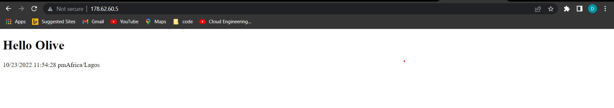

# Task:

## Create an Ansible Playbook to setup a server with Apache
The server should be set to the Africa/Lagos Timezone  
Host an index.php file as the main file on the server:

### A screenshot of the rendered page.
